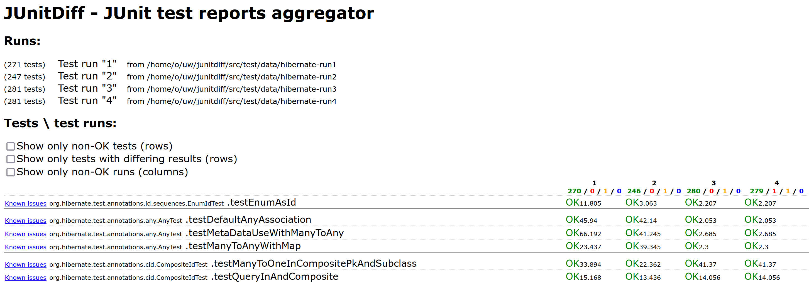

🥪 JUnitDiff - JUnit test reports aggregator and reporter
==========================================================
2022 revival

JUnitDiff is a tool, which aggregates several JUnit reports, 
and creates a comprehensible comparison table.
Here is a sample output screenshot:

---



---

Clicking on the `OK` reveals the output (and a stacktrace) of that test.


### Usage:

```
java -jar JUnitDiff.jar <input1> <input2> ... -o <output-path> [-xml]
```

Where `<input>` may be one of:

* Path to a JUnit XML report file.

      java -jar JUnitDiff.jar -o aggregatedReport.xml ./target/surefire-reports/
 
* Path to a directory. JUnitDiff scans the directory for `.xml` files.

      ls -1 ./target/surefire-reports > target/listOfReports.txt
      java -jar JUnitDiff.jar -o aggregatedReport.xml target/listOfReports.txt

* Path to a text file with a list of paths to JUnit XML report files.

      cd target/surefire-reports/
      java -jar JUnitDiff.jar -o aggregatedReport.xml ./TEST-MyClass.xml ./TEST-OtherClass.xml

* URL to a ZIP file containing JUnit XML report files.

      java -jar JUnitDiff.jar -o aggregatedReport.xml https://mycompany.github.com/myproject/build/123/artifacts/junitReports.zip

The `-xml` option skips creating the HTML output, and instead, produces an aggregated XML.

You can use the XSLT template on it to get the HTML on the fly, using `xsltproc` or `Xalan`:
```
./xslt/transformToHTML.sh aggregatedReport.xml
```

## Changelog

* **Plan for 2.1:** Make it also a Maven reporting plugin. 
* **Plan for 2.0:** Planning to make it great again.
  * Make it work 
  * Clean up the xslt/ dir
  * Make the transformation without a bash script
* **Version 1.6:** Switched to kotlin
* **Version 1.5:** Not sure what happened there but XSLT seems not to work
* **Version 1.4:** Last version known to work properly